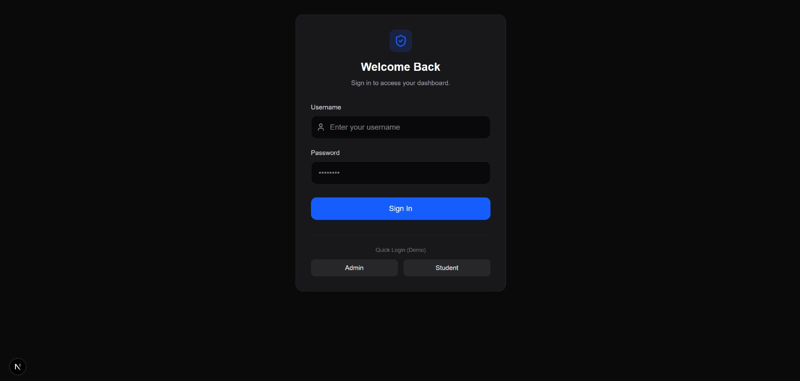
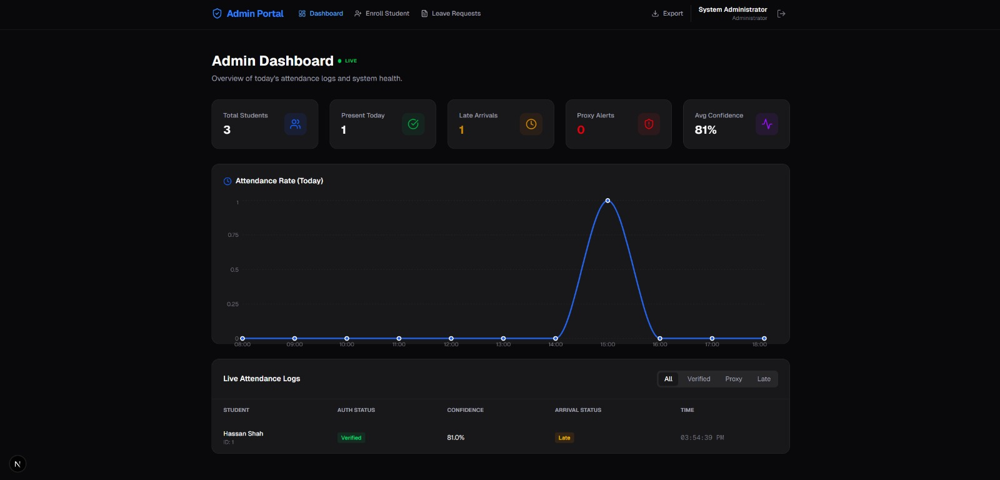
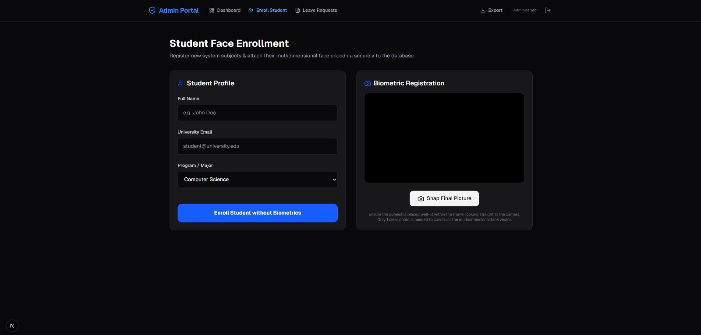

🎓 Smart Attendance System
AI-Powered Face Recognition with Multi-Factor Authentication
> **Author:** [Musfirah Sheikh](https://github.com/MusfirahSheikh8) &nbsp;|&nbsp; **Architecture:** Microservices


---


📌 Overview
The Smart Attendance System is a production-grade, full-stack attendance management platform that replaces traditional manual roll calls with real-time facial recognition and OTP-based two-factor authentication. Built with a decoupled microservices architecture, the system spans across a Node.js REST API, a Python computer vision service, and a Next.js frontend — all communicating over HTTP.

Designed for institutions and organizations that need a secure, scalable, and audit-ready attendance solution.

---


🏗️ Architecture Overview

```
┌─────────────────────────────────────────────────────────────────┐
│                        CLIENT LAYER                             │
│             Next.js 15 + React 19 (Port 3001)                   │
│         Webcam Capture · Admin Dashboard · Tailwind UI          │
└────────────────────────┬────────────────────────────────────────┘
                         │ HTTP / REST
         ┌───────────────┴────────────────┐
         │                                │
┌────────▼────────┐             ┌─────────▼────────┐
│  Node.js API    │             │  Python Vision   │
│  (Port 3000)    │◄───────────►│  Microservice    │
│  Express + TS   │    HTTP     │  (Port 8000)     │
│  JWT · OTP · DB │             │  Flask + dlib    │
└────────┬────────┘             │  OpenCV · FR     │
         │                      └──────────────────┘
┌────────▼────────┐
│    Database     │
│  Oracle DB      │
│  PL/SQL · Trig  │
│  Views · Audit  │
└─────────────────┘
```
---


🗂️ Project Structure


```
smart-attendance-system/
│
├── 📁 backend/                  # Node.js + TypeScript Core API
│   ├── src/
│   │   ├── controllers/         # Route handlers & business logic
│   │   ├── middleware/          # JWT auth, rate limiting, validation
│   │   ├── routes/              # API endpoint definitions
│   │   └── services/            # OTP, email/SMS, DB integrations
│   ├── .env.example
│   └── package.json
│
├── 📁 python-service/           # Computer Vision Microservice
│   ├── app/
│   │   ├── recognition/         # Face encoding & comparison logic
│   │   └── anti_spoofing/       # Liveness detection algorithms
│   ├── run.py
│   ├── requirements.txt
│   └── .env.example
│
├── 📁 frontend/                 # Next.js 15 + Tailwind CSS UI
│   ├── app/                     # App Router pages
│   ├── components/              # Webcam, dashboard, charts
│   └── package.json
│
├── 📁 database/                 # SQL Schemas & Migrations
│   ├── migrations/
│   ├── procedures/
│   ├── triggers/
│   └── views/
│
└── start_all.bat                # One-click Windows launcher
```
---
✨ Key Features

Feature	Description

🤖 Real-Time Face Recognition	Deep learning-based face matching using `dlib` and `opencv-python` with configurable confidence thresholds

🛡️ Anti-Spoofing / Liveness Detection	Geometric facial landmark analysis rejects 2D photo and video spoofing attempts

🔐 OTP Two-Factor Authentication	Email/SMS-delivered one-time passwords provide a second verification layer beyond biometrics

📸 In-Browser Webcam Capture	`react-webcam` captures Base64-encoded frames directly in the browser — no disk I/O

📊 Admin Analytics Dashboard	Live charts (`recharts`) visualizing attendance logs, confidence scores, and access events

🔒 JWT Authentication	Stateless token-based auth securing all API routes

🚦 Rate Limiting	Failed attempt tracking with automatic lockout to deter brute-force attacks

🗃️ Audit Trail	Database-level triggers log every biometric event and OTP transaction

---

🛠️ Tech Stack

Backend — `/backend`

Runtime: Node.js 18+ with TypeScript

Framework: Express.js

Auth: JWT (JSON Web Tokens)

Integrations: Email / SMS gateway for OTP delivery

Database Driver: `oracledb` Node.js driver (configured via `.env`)

Python Vision Microservice — `/python-service`

Framework: Flask

Computer Vision: `opencv-python`, `dlib`

Face Recognition: `face_recognition` library (HOG + CNN models)

Anti-Spoofing: Geometric facial landmark distance mapping

Frontend — `/frontend`

Framework: Next.js 15 (App Router)

UI Library: React 19 + Tailwind CSS

Icons: `lucide-react`

Charts: `recharts`

Camera: `react-webcam`

Database — `/database`

Engine: Oracle Database

Features: Stored procedures, triggers, indexed views, migration scripts, PL/SQL

---

🚀 Getting Started

Prerequisites

Node.js v18 or higher

Python 3.9 or higher

C++ Build Tools (required for `dlib` compilation)

Windows: Visual Studio Build Tools

Ubuntu: `sudo apt install build-essential cmake`

macOS: `xcode-select --install`

A running Oracle Database instance (Oracle 19c+ recommended)

---

⚡ Quick Start (Windows)

```bash

# Simply double-click the batch file at the project root:

start_all.bat

```

This spawns all three services in independent terminal windows automatically.

---

🔧 Manual Setup

1. Database
   
```bash

cd database

# Apply migrations to your configured DB instance

# See /database/migrations/ for ordered SQL files
```

2. Node.js Backend (Port 3000)
   
```bash

cd backend

cp .env.example .env        # Fill in DB credentials, JWT secret, OTP provider keys

npm install

npm run dev

```

3. Python Vision Microservice (Port 8000)
   
```bash

cd python-service

python -m venv venv


# Activate virtual environment

# Windows:

venv\Scripts\activate

# macOS / Linux:

source venv/bin/activate


cp .env.example .env        # Configure confidence thresholds

pip install -r requirements.txt

python run.py

```

> ⚠️ `dlib` requires C++ Build Tools. Ensure they are installed before running `pip install`.

4. Next.js Frontend (Port 3001)
   
```bash

cd frontend

npm install

npm run dev

```

Open http://localhost:3001 in your browser.

---

🔐 Environment Configuration

Both the backend and python-service require `.env` files before the system runs correctly.

`/backend/.env` — key variables:

```env

DB_USER=your_oracle_user

DB_PASS=your_oracle_password

DB_CONNECTION_STRING=localhost:1521/XEPDB1


JWT_SECRET=your_jwt_secret

JWT_EXPIRES_IN=7d

OTP_PROVIDER_API_KEY=your_otp_provider_key

EMAIL_FROM=noreply@yourdomain.com

```

`/python-service/.env` — key variables:

```env

FACE_CONFIDENCE_THRESHOLD=0.6

LIVENESS_SCORE_THRESHOLD=0.5

BACKEND_API_URL=http://localhost:3000

```
> 🔴 **Never commit `.env` files to version control.** Both are included in `.gitignore`.

---

🛡️ Security Architecture

```

User presents face to webcam

         │
         ▼
[1] Liveness Check (Anti-Spoofing)

    → Geometric landmark analysis

    → Rejects photos & 2D replays

         │
         ▼

[2] Face Recognition (Python Service)

    → Compares against stored biometric encodings

    → Returns confidence score

         │
         ▼
[3] OTP Verification (Node.js Backend)

    → Sends time-limited code via Email/SMS

    → User must confirm physical possession of device

         │
         ▼
[4] Attendance Marked + Audit Log Written

    → Timestamped DB record with confidence metadata

    → Admin dashboard updated in real-time

```
---

📡 API Reference

Face Recognition Service (Port 8000)

Method	Endpoint	Description

`POST`	`/api/verify`	Submit Base64 image for face recognition

`POST`	`/api/enroll`	Register a new face encoding

`GET`	`/api/health`	Service health check

Backend API (Port 3000)

Method	Endpoint	Description

`POST`	`/auth/login`	Authenticate user, receive JWT

`POST`	`/attendance/mark`	Mark attendance (requires valid JWT + OTP)

`POST`	`/otp/send`	Trigger OTP dispatch to registered contact

`POST`	`/otp/verify`	Validate submitted OTP

`GET`	`/admin/logs`	Retrieve attendance and access logs

`GET`	`/admin/users`	User management (admin role required)

---

🗃️ Database Schema (Overview)

```sql

Users               -- Core identity: name, email, phone, role

BiometricEncodings  -- Multidimensional face vectors linked to users

AttendanceLogs      -- Timestamped records with confidence scores

OtpAuditTrail       -- Every OTP send/verify event with status

AccessLogs          -- Failed attempts, IP, timestamps

```

Triggers automatically populate `AccessLogs` on failed recognition or OTP mismatch events.

---

## 🖥️ Screenshots

### 🔐 Login Page


> Role-based authentication with quick demo login for Admin and Student portals.

---

### 📊 Admin Dashboard


> Live attendance overview — total students, present today, late arrivals, proxy alerts, and average confidence score with a real-time attendance rate chart.

---

### 👤 Student Face Enrollment


> Admin registers new students by capturing their face via webcam. The biometric encoding is computed and stored securely in Oracle DB.

---

### 📝 Leave Application — Student Portal


> Students submit leave requests with date and reason directly from their portal.

---

### ✅ Leave Management — Admin Portal


> Admins review pending leave requests and approve or reject them in one click.

🤝 Contributing

Fork the repository

Create your feature branch: `git checkout -b feature/your-feature`

Commit your changes: `git commit -m 'Add: your feature description'`

Push to the branch: `git push origin feature/your-feature`

Open a Pull Request

Please follow the existing code style and include relevant tests where applicable.

---

📄 License

This project is licensed under the MIT License — see the LICENSE file for details.

---

👩‍💻 Author

Musfirah Sheikh

GitHub: @MusfirahSheikh8

---

<div align="center">
  
  <sub>Built with ❤️ — Smart Attendance System · 🎉</sub>
</div>

